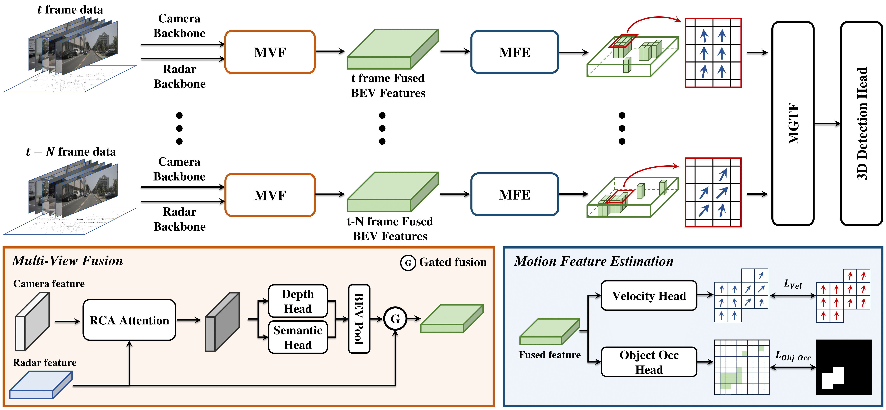

<div align="center">   
  
# CRT-Fusion: Camera, Radar, Temporal Fusion Using Motion Information for 3D Object Detection, NeurIPS 2024
</div>

> - [Paper in arXiv](https://arxiv.org/pdf/2411.03013)
> Jisong Kim*, Minjae Seong*, Jun Won Choi**


# Abstract
Accurate and robust 3D object detection is a critical component in autonomous vehicles and robotics. While recent radar-camera fusion methods have made significant progress by fusing information in the bird's-eye view (BEV) representation, they often struggle to effectively capture the motion of dynamic objects, leading to limited performance in real-world scenarios. In this paper, we introduce CRT-Fusion, a novel framework that integrates temporal information into radar-camera fusion to address this challenge. Our approach comprises three key modules: Multi-View Fusion (MVF), Motion Feature Estimator (MFE), and Motion Guided Temporal Fusion (MGTF). The MVF module fuses radar and image features within both the camera view and bird's-eye view, thereby generating a more precise unified BEV representation. The MFE module conducts two simultaneous tasks: estimation of pixel-wise velocity information and BEV segmentation. Based on the velocity and the occupancy score map obtained from the MFE module, the MGTF module aligns and fuses feature maps across multiple timestamps in a recurrent manner. By considering the motion of dynamic objects, CRT-Fusion can produce robust BEV feature maps, thereby improving detection accuracy and robustness. Extensive evaluations on the challenging nuScenes dataset demonstrate that CRT-Fusion achieves state-of-the-art performance for radar-camera-based 3D object detection. Our approach outperforms the previous best method in terms of NDS by +1.7%, while also surpassing the leading approach in mAP by +1.4%. These significant improvements in both metrics showcase the effectiveness of our proposed fusion strategy in enhancing the reliability and accuracy of 3D object detection. 


<h1>Methods <a href="https://youtube.com/shorts/BvfSRl9MKnw" target="_blank">[Demo]</a></h1>


**Overall architecture of CRT-Fusion**: Features are extracted from radar and camera data using backbone networks at each timestamp. The MVF module combines these features to generate fused BEV feature maps. The MFE module predicts the location and velocity of dynamic objects from these maps. The MGTF module then uses the predicted motion information to create the final feature map for the current timestamp, which is fed into the 3D detection head.


# Getting Started
Please see [getting_started.md](docs/getting_started.md)


## Training (R50 CRT-Fusion)
**Phase 1:**
```shell
./tools/dist_train.sh configs/crt-fusion/crtfusion-r50-fp16_phase1.py 4 --gpus 4 --work-dir {phase1_work_dirs} --no-validate
python tools/swap_ema_and_non_ema.py {phase1_work_dirs}/iter_10548.pth
```
**Phase 2:**
```shell
./tools/dist_train.sh configs/crt-fusion/crtfusion-r50-fp16_phase2.py 4 --gpus 4 --work-dir {phase2_work_dirs} --resume-from {phase1_work_dirs}/iter_10548_ema.pth
python tools/swap_ema_and_non_ema.py {phase2_work_dirs}/iter_42192.pth
```

## Inference (R50 CRT-Fusion)
**Run the following commands:**
```shell
./tools/dist_test.sh configs/crt-fusion/crtfusion-r50-fp16_phase2.py {phase2_work_dirs}/iter_42192_ema.pth 1 --eval bbox
```

## Model Zoo
We further optimized our models, which resulted in a slight difference compared to the performance reported in the paper.

|Method|mAP|NDS|Model
|-|-|-|-|
|[**R50 CRT-Fusion**](configs/crt-fusion/crtfusion-r50-fp16_phase2.py)|50.0|57.2|[Link](https://github.com/Divadi/SOLOFusion/releases/download/v0.1.0/r50-shortonly-fp16_ema.pth)
|[**R50 CRT-Fusion-light-cbgs**](configs/crt-fusion/crtfusion-r50-fp16_phase2_light_cbgs.py)|48.8|57.8|[Link](https://github.com/Divadi/SOLOFusion/releases/download/v0.1.0/r50-longonly-fp16_phase2_ema.pth)


## Acknowledgements
We thank numerous excellent works and open-source codebases:
- [MMDetection3D](https://github.com/open-mmlab/mmdetection3d)
- [BEVDepth](https://github.com/Megvii-BaseDetection/BEVDepth)
- [SOLOFusion](https://github.com/Divadi/SOLOFusion)
- [RCM-Fusion](https://github.com/mjseong0414/RCM-Fusion)


# Bibtex
If this work is helpful for your research, please consider citing the following BibTeX entry.

```
@article{kim2024crt,
  title={CRT-Fusion: Camera, Radar, Temporal Fusion Using Motion Information for 3D Object Detection},
  author={Kim, Jisong and Seong, Minjae and Choi, Jun Won},
  journal={arXiv preprint arXiv:2411.03013},
  year={2024}
}
```